## 现状
  
  
距离疫情发生已经过去了近四个月时间了，在这段时间里大家经历了一场前所未有的防疫战斗。从2019年12月开始，陆续有武汉市民被确诊为“不明肺炎病症”，2020年1月7日，初步判定该疾病元凶为新型冠状病毒，接着，疫情爆发，专家证实了该病毒具有人传人的性质，武汉发出交通封城通告，全国各地纷纷紧急启动一级响应，国家紧急筹建火神山雷神山医院，各地纷纷向武汉提供紧急援助。截至2020年4月，我国新冠疫情已经基本稳定，多地传来了零新增的好消息，但战斗还远远未结束。
 
 
我们通过一些可视化信息来分析到2020年4月我国的疫情状况：


## ①中国疫情现状  


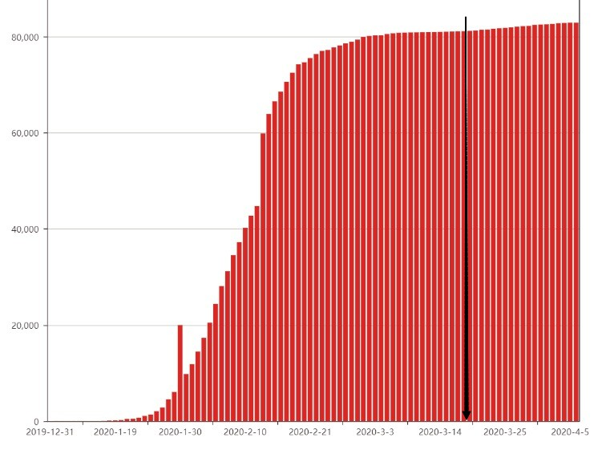
  
图1：中国新冠肺炎每日累计感染人数时序图（单位：人）

## ②每日新增感染人数组成分析

```{r echo=FALSE, results='asis'}
data1 <- read.table("CHINA.csv",header = TRUE,sep = ",")

time_day<-as.Date(data1$time,"%Y/%m/%d")
number = data1$total.day
b = data1$foreign.day
data2 <- cbind(as.Date(time_day),number,b)
data3 <- data.frame(data2)
library(ggplot2)
ggplot()+
    geom_line(data=data3,aes(y=number,x = time_day,colour="darkblue"),size = 1 )+
    geom_line(data=data3,aes(y=b,x = time_day,colour="red"),size = 1)+
  scale_color_discrete(name = "lable", labels = c("total", "foreign"))

```

图2：每日新增感染人数与境外输入人数对比（单位：人）

## ③中国境外输入病例分布状况

```{r echo=FALSE, results='hide',message = FALSE}
library(jsonlite);library(rjson);library(RJSONIO)
library(ggplot2);library(RColorBrewer);library(lubridate)
library(plyr);library(dplyr);library(rgdal)
library(sf);library(geojsonio);library(sp);library(ggthemes)

x<-readOGR("省级行政区.shp",stringsAsFactors=FALSE,encoding="UTF-8")

prov_map<-fortify(x)

p_id=read.csv("境外输入数据.csv")

totalp=data.frame(id=p_id$id,pnum=p_id$number,
                 number=cut(p_id$number,breaks=c(-10,-1,0.5,10,20,30,40,50,100,192),
                                    labels=c("NA","=0","1-10","11-20","21-30","31-40","41-50","51-100",">=101"),
                                    order = TRUE,include.lowest = TRUE,right = F))
                                    
ttp<-merge.data.frame(prov_map,totalp,by.prov_map="id",by.totalp="id")

```

```{r echo=FALSE, results='asis'}
ggplot()+
  geom_polygon(data=ttp,aes(x=long,y=lat,group=group,
                              fill=number),colour="black",size=0.25)+
  scale_fill_manual(values = brewer.pal(8,"Reds"))

```
  
  图3：境外病例分布输入状况（截至5/4/2020）
  
## ④国外疫情状况

```{r echo=FALSE, results='asis'}
data31 <- read.table("FOREIGN.csv",header = TRUE,sep = ",")

ggplot(data31,aes(x=country,y=number.ten.thousand.,color = continent
)) +geom_point(shape = 2,size = 2,alpha = 1)

```
  
  图4：全球新型管状病毒累计感染人数前12个国家的分布（截至12/4/2020）


## 1.内容简介

前期准备：  

①模型介绍、文献解读 （程宏宇） 

②欧洲疫情状况预测及R代码展示 （王帆）


研究成果：  

①中国境外输入导致二次爆发状况预测 （孙融雪）

②结果评价与原因分析 （刘晓菡）

## 2.数据来源

本次研究数据来源于：  

①中国卫健委：http://www.nhc.gov.cn/xcs/xxgzbd/gzbd_index.shtml
  
②意大利卫生部：http://www.salute.gov.it/portale/nuovocoronavirus/archivioComunicatiNuovoCoronavirus.jsp


## 3.文献介绍


*题目：  

利用Logistic模型估计冠状病毒COVID19第二期疫情的最终规模

*来源：  

https://www.medrxiv.org/content/10.1101/2020.03.11.20024901v2

*发布时间：  
  
2020.03.16

## 3.1 模型介绍


3.1.1罗吉斯特增长模型


逻辑增长模型，俗称“S”曲线，又称自我抑制性方程。由Verhulst于1845年提出，用于模拟人口的增长。其特点是开始增长缓慢，而在以后某一时点上开始迅速增长，达到一定水平后，增长速度又逐渐放慢。

该模型将发病百分率转换为逻辑值，在平面坐标图中以逻辑值为纵坐标对时间进行作图。逻辑值与纵轴相交的结点为初始病害数量，逻辑值的斜率为病害流行速度，也就是浸染速率。其与指数模型最重要的不同之处就是方程右边增加修正因子，使模型本身包含自我抑制作用。


## 3.1.1 罗吉斯特增长模型 

曲线形状大致如图所示：
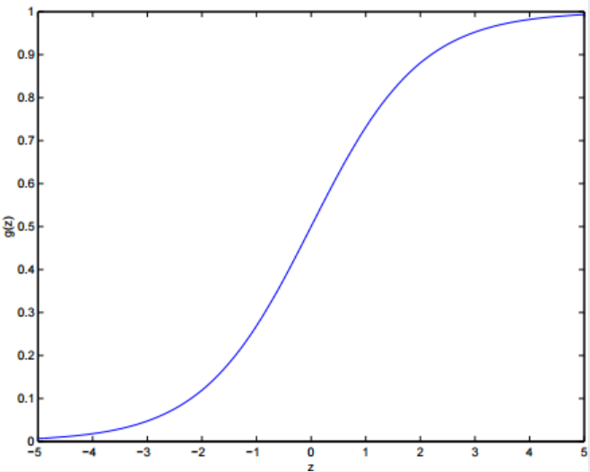
  
  
## 3.1.1 罗吉斯特增长模型

通常，逻辑曲线划分为五个时期：  

①开始期。又称潜伏期，此时种群个体数很少，密度 增长缓慢。 

②加速器。随着个体数量的增加，密度增长逐渐加快。  

③转折期。当个体数 目达到 自然环境可容纳的饱和密度一半时，密度增长最快。  

④减速期。现存个体数超过饱和数目一半以后，密度增长逐渐变慢。

⑤饱和期。种群个 体数达到饱和值从而停止 增长。

## 3.1.1 罗吉斯特增长模型
  
  


  
  
C：累积病例数  

r：感染率（大于0）  

K：传染病最终规模


## 3.1.1 罗吉斯特增长模型

当初始值大于零时，可将式子变形为：
  
  
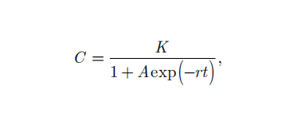
  
  
  
其中，A=(K-C)/C


## 3.1.2 优点

  
  
  
在预测新冠疫情规模的问题中，作者曾将逻辑增长模型与SIR模型预测结果进行比较，发现两者结果精度相差无几，但逻辑增长模型给出了更加明确和简便的算法，而SIR模型对参数的初始假想值依赖较大。


## 3.1.3 缺点

  
  
逻辑增长模型内部不嵌有自然法则和原理，故无法描述有关有症状感染者和无症状感染者等等问题，且模型存在成立的充分条件，即预测的最终规模理论上应该大于当前观测到的累计感染者，否则将强制退出模型。


## 3.2 数学推导

3.2.1 拐点求解

传染病增长率在导数为零将达到最大值，在这个条件下，我们可以得到基于现有数据的增长率高峰时点及此时的感染规模和传染率。

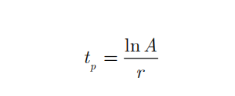

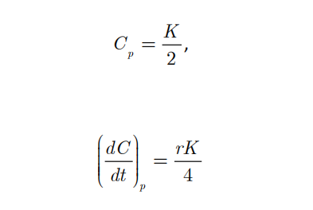

## 3.2 数学推导

3.2.2 初始值确定
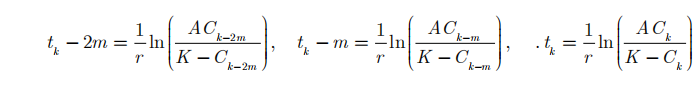  
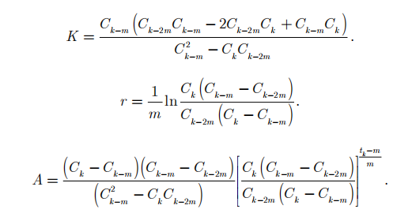

现在，假设我们可以得到n期的患病人数，那么就可以预测各期相应的最终规模，当模型达到收敛状态时(不再满足模型成立条件时)，就可以得出最终结论。


## 3.3 结果分析

表1：中国的逻辑增长模型参数估计值（截至2020.03.11）
  
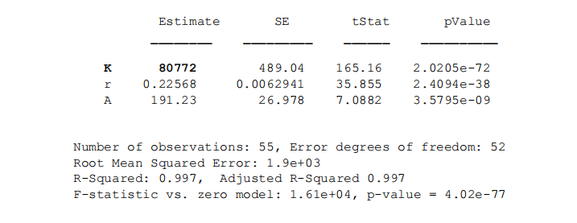

根据可获得的数据，我们可以最终估计出中国新冠疫情的最终规模，约为81000例，误差约为500人左右。


## 3.3 结果分析
表2：中国疫情数据逻辑回归的日模拟结果（截至2020.03.04）
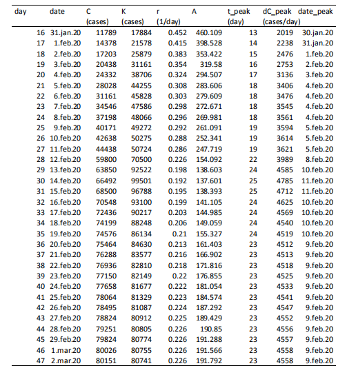

从图中可以看出，新冠疫情高峰大约出现在2020.02.09前后


## 3.3 结果分析


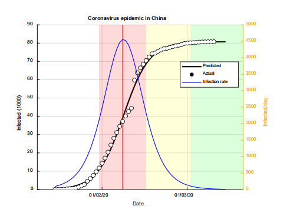

图1：中国新冠疫情数据拟合结果


从图中可以看出，模型预测情况良好，且截至2020.03.11，可以认为中国疫情基本处于结束阶段。


## 3.3 结果分析
 
表4：模型短期预测结果
  
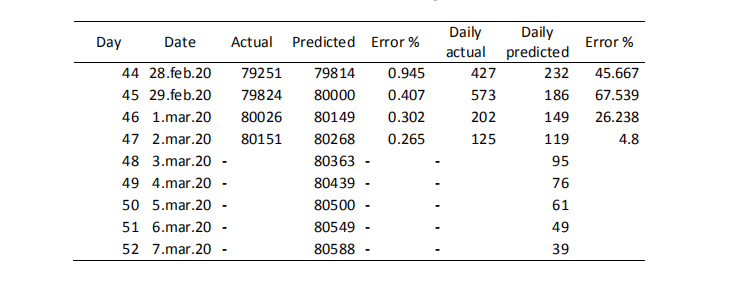 
 
分析：我们可以看到实际和预测病例数的差异在2%以内。至2020年3月7日，预测累计病例数为计80588例，日增病例数为39例。而根据国家卫健委的报告，当日我国累计感染人数为80695人，新增人数为44人。
证明模型预测的准确度和鲁棒性都比较好。


## 进一步研究
  
  
接下来，我们将以意大利为例来研究欧洲国家疫情发展状况。


