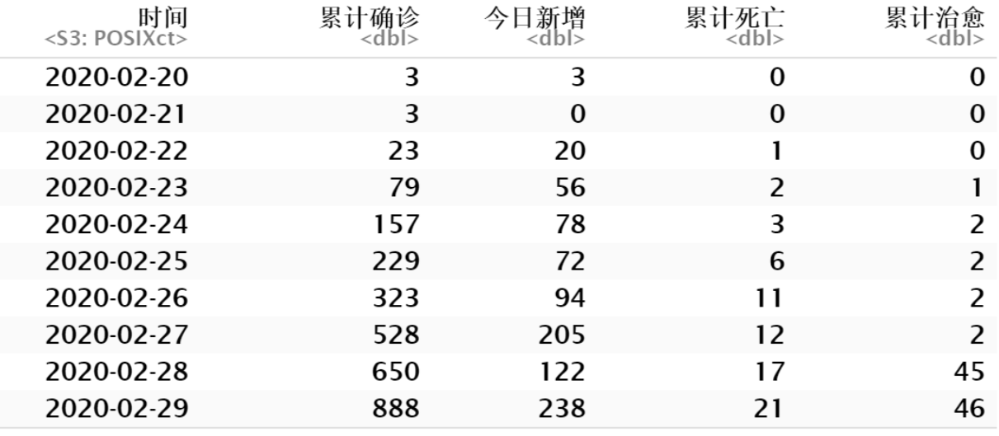
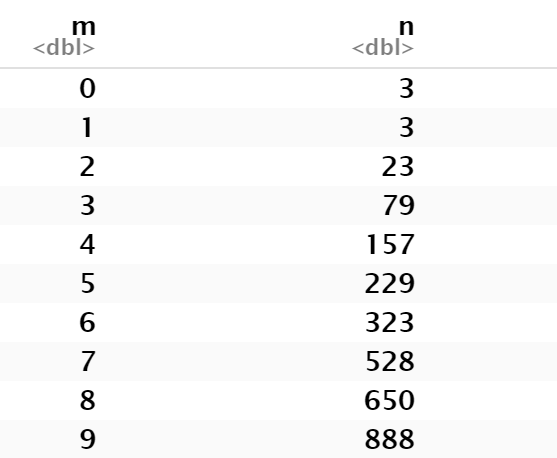
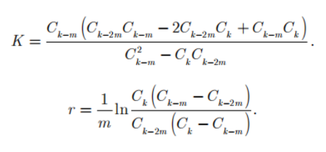
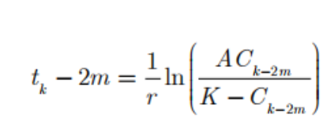
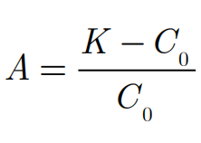

## 现状
  
  
距离疫情发生已经过去了近四个月时间了，在这段时间里大家经历了一场前所未有的防疫战斗。  
从2019年12月开始，陆续有武汉市民被确诊为“不明肺炎病症”，2020年1月7日，初步判定该疾病元凶为新型冠状病毒，接着，疫情爆发，专家证实了该病毒具有人传人的性质，武汉发出交通封城通告，全国各地纷纷紧急启动一级响应，国家紧急筹建火神山雷神山医院，各地纷纷向武汉提供紧急援助。截至2020年4月，我国新冠疫情已经基本稳定，多地传来了零新增的好消息，但战斗还远远未结束。
 
 
我们通过一些可视化信息来分析到2020年4月我国的疫情状况：


## ①中国疫情现状  


  
图1：中国新冠肺炎每日累计感染人数时序图（单位：人）

## ②每日新增感染人数组成分析

```{r echo=FALSE, results='asis'}
data1 <- read.table("CHINA.csv",header = TRUE,sep = ",")

time_day<-as.Date(data1$time,"%Y/%m/%d")
number = data1$total.day
b = data1$foreign.day
data2 <- cbind(as.Date(time_day),number,b)
data3 <- data.frame(data2)
library(ggplot2)
ggplot()+
    geom_line(data=data3,aes(y=number,x = time_day,colour="darkblue"),size = 1 )+
    geom_line(data=data3,aes(y=b,x = time_day,colour="red"),size = 1)+
  scale_color_discrete(name = "lable", labels = c("total", "foreign"))

```

图2：每日新增感染人数与境外输入人数对比（单位：人）

## ③中国境外输入病例分布状况

```{r echo=FALSE, results='hide',message = FALSE}
library(jsonlite);library(rjson);library(RJSONIO)
library(ggplot2);library(RColorBrewer);library(lubridate)
library(plyr);library(dplyr);library(rgdal)
library(sf);library(geojsonio);library(sp);library(ggthemes)

x<-readOGR("省级行政区.shp",stringsAsFactors=FALSE,encoding="UTF-8")

prov_map<-fortify(x)

p_id=read.csv("境外输入数据.csv")

totalp=data.frame(id=p_id$id,pnum=p_id$number,
                 number=cut(p_id$number,breaks=c(-10,-1,0.5,10,20,30,40,50,100,192),
                                    labels=c("NA","=0","1-10","11-20","21-30","31-40","41-50","51-100",">=101"),
                                    order = TRUE,include.lowest = TRUE,right = F))
                                    
ttp<-merge.data.frame(prov_map,totalp,by.prov_map="id",by.totalp="id")

```

```{r echo=FALSE, results='asis'}
ggplot()+
  geom_polygon(data=ttp,aes(x=long,y=lat,group=group,
                              fill=number),colour="black",size=0.25)+
  scale_fill_manual(values = brewer.pal(8,"Reds"))

```
  
  图3：境外病例分布输入状况（截至5/4/2020）
  
## ④国外疫情状况

```{r echo=FALSE, results='asis'}
data31 <- read.table("FOREIGN.csv",header = TRUE,sep = ",")

ggplot(data31,aes(x=country,y=number.ten.thousand.,color = continent
)) +geom_point(shape = 2,size = 2,alpha = 1)

```
  
  图4：全球新型管状病毒累计感染人数前12个国家的分布（截至12/4/2020）


## 1.内容简介

前期准备：  

①模型介绍、文献解读 

②欧洲疫情预测及R代码展示 


研究成果：  

①境外输入导致中国疫情二次爆发状况预测 

②结果评价与原因分析 

## 2.数据来源

本次研究数据来源于：  

①中国卫健委：http://www.nhc.gov.cn/xcs/xxgzbd/gzbd_index.shtml
  
②意大利卫生部：http://www.salute.gov.it/portale/nuovocoronavirus/archivioComunicatiNuovoCoronavirus.jsp


## 3.文献介绍


*题目：  

利用Logistic模型估计冠状病毒COVID19第二期疫情的最终规模

*来源：  

https://www.medrxiv.org/content/10.1101/2020.03.11.20024901v2

*发布时间：  
  
2020.03.16

## 3.1 模型介绍


3.1.1 逻辑斯蒂增长模型


逻辑斯蒂增长模型，俗称“S”曲线，又称自我抑制性方程。由Verhulst于1845年提出，用于模拟人口的增长。其特点是开始增长缓慢，而在以后某一时点上开始迅速增长，达到一定水平后，增长速度又逐渐放慢。

该模型将发病百分率转换为逻辑值，在平面坐标图中以逻辑值为纵坐标对时间进行作图。逻辑值与纵轴相交的结点为初始病害数量，逻辑值的斜率为病害流行速度，也就是浸染速率。其与指数模型最重要的不同之处就是方程右边增加修正因子，使模型本身包含自我抑制作用。


## 3.1.1 逻辑斯蒂增长模型 

曲线形状大致如图所示：

  
  
## 3.1.1 逻辑斯蒂增长模型

通常，逻辑斯蒂曲线划分为五个时期：  

①开始期。又称潜伏期，此时种群个体数很少，密度 增长缓慢。 

②加速器。随着个体数量的增加，密度增长逐渐加快。  

③转折期。当个体数 目达到 自然环境可容纳的饱和密度一半时，密度增长最快。  

④减速期。现存个体数超过饱和数目一半以后，密度增长逐渐变慢。

⑤饱和期。种群个 体数达到饱和值从而停止 增长。

## 3.1.1 逻辑斯蒂增长模型
  
  


  
  
C：累积病例数  

r：感染率（大于0）  

K：传染病最终规模


## 3.1.1 逻辑斯蒂增长模型

当初始值大于零时，可将式子变形为：
  
  

  
  
  
其中，A=(K-C)/C


## 3.1.2 优点

  
  
  
在预测新冠疫情规模的问题中，作者曾将逻辑增长模型与SIR模型预测结果进行比较，发现两者结果精度相差无几，但逻辑增长模型给出了更加明确和简便的算法，而SIR模型对参数的初始值设定依赖较大。


## 3.1.3 缺点

  
  
逻辑增长模型内部不嵌套自然法则和原理，故无法描述有关治愈率、无症状感染者等等问题，且模型存在成立的充分条件，即预测的最终规模理论上应该大于当前观测到的累计感染者，否则将强制退出模型。


## 3.2 数学推导

3.2.1 拐点求解

传染病增长率在导数为零将达到最大值，在这个条件下，我们可以得到基于现有数据的增长率高峰时点t及此时的感染规模C和传染率。


## 3.2 数学推导

3.2.2 初始值确定
  


现在，假设我们可以得到n期的患病人数，那么就可以预测各期相应的最终规模，当模型达到收敛状态时(不再满足模型成立条件时)，就可以得出最终结论。


## 3.3 结果分析

表1：中国的逻辑增长模型参数估计值（截至2020.03.11）
  


根据可获得的数据，我们可以最终估计出中国新冠疫情的最终规模，约为81000例，误差约为500人左右。


## 3.3 结果分析
表2：中国疫情数据逻辑回归的日模拟结果（截至2020.03.04）


从图中可以看出，新冠疫情高峰大约出现在2020.02.09前后


## 3.3 结果分析


图1：中国新冠疫情数据拟合结果


从图中可以看出，模型预测情况良好，且截至2020.03.11，可以认为中国疫情基本处于结束阶段。


## 3.3 结果分析
 
表4：模型短期预测结果
  
 
 
分析：我们可以看到实际和预测病例数的差异在2%以内。至2020年3月7日，预测累计病例数为计80588例，日增病例数为39例。而根据国家卫健委的报告，当日我国累计感染人数为80695人，新增人数为44人。  
  
可以看出模型预测的准确度和鲁棒性都比较好。


## 进一步研究
  
  
接下来，我们将以意大利为例来研究欧洲国家疫情发展状况。
首先，我们想要绘制出2020.2.20-2020.4.19的意大利疫情的趋势图（包含时间、累计确诊数、今日新增数、累计死亡数以及累计治愈数）五列，时间为x轴，其他四个变量作为y来绘制散点图。

```{r echo=FALSE,results='hide',message = FALSE}
library(readxl)
data = read_excel("./data_Italy.xlsx",sheet = 1) 
```

 将excel数据导入，得到数据如下图。共五列：时间、累计确诊数、今日新增数、累计死亡数、累计治愈数。
 

  
## 作图代码和结果如下：


```{r}
fills=c('累计确诊'="blue",'今日新增'="yellow",'累计死亡'="lightpink",'累计治愈'="red")
library(ggplot2)
names(data)<-c("x","y1","y2","y3","y4")
ggplot(data)+geom_point(aes(x,y=y1,fill="累计确诊"),size=3,shape=21,color="black")+geom_point(aes(x,y=y2,fill="今日新增"),size=3,shape=21)+
geom_point(aes(x,y=y3,fill="累计死亡"),size=3,shape=21)+
geom_point(aes(x,y=y4,fill="累计治愈"),size=3,shape=21)+
scale_fill_brewer(limits=c('累计确诊','今日新增','累计死亡','累计治愈'))+
theme(plot.title = element_text(hjust = 0.5)) 
```
  
  
  上图为意大利的疫情趋势图，可以看出意大利的累计确诊数已经开始逐渐趋于放缓，每日新增人数也开始逐渐减少。累计治愈人数开始逐渐变多且增长的速度逐渐变快。而累计死亡人数的增速也开始放缓，意大利疫情开始呈现出收敛的态势。
  而后通过逻辑斯蒂增长模型对意大利疫情进行预测。
  
## **Logistic增长模型估计意大利疫情**

  在对意大利疫情进行估计的过程中，首先将数据进行导入。选取了2020.2.20-2020.4.19共60天数据。数据分别用m,n来表示。它们分别代表时间以及累积确诊病例数。在这里，m表示疫情爆发的天数（共60天）。将这两列数据合并为df。
  
```{r echo=FALSE, results='hide',message = FALSE}
n<-c(3,3,23,79,157,229,323,528,650,888,1128,1694,2036,2502,3144,3927,4680,6012,7424,9172,10293,12462,15385,17660,21157,24747,27980,31506,35713,41035,47021,53578,59138,63927,69176,74386,80539,86498,92472,97689,101739,105792,110574,115242,119827,124632,128948,132547,135586,139422,143626,147577,152271,156363,159516,162488,165155,168941,172434,175925)
m<-(0:59)
df<-as.data.frame(cbind(m,n))
```
  
下表展示了合并之后的数据df。



  
## 计算参数初始值

  在数据导入结束后，为了进行后续的预测，需要对参数的初始值进行估计。论文中给出了参数初始值的估计方法。
  
  首先，我们整体观察初始值的计算公式：

 


  
  在确定参数的时候，论文中表示，选取第一个数据、中间数据以及最后一个数据来计算初值。C为累计确诊病例数。因此，首先计算出这三个位置的数据值。并分别取名为c_max，c_median,c_min。他们分别对应公式中的
  
$C_k$,$C_{k-m}$,$C_{k-2m}$

```{r echo=FALSE, results='hide',message = FALSE}
c_max=max(n)
c_min=min(n)
c_median=median(n)
c_max
c_median
c_min
```

## 计算得出这三个值如下
name | 数值 | 
-|-|
$C_k$ | 175925 |
$C_{k-m}$ | 44028 |
$C_{k-2m}$ | 3 |


## 进一步计算初始值k0,r0,n0

根据以下两个公式首先计算出k0，r0。

其中，由于

$C_k$,$C_{k-m}$,$C_{k-2m}$

分别代表的是最大值，中值，最小值。而他们的下角标为k,k-m,k-2m。因此，m是由数据长度除以2来表示的。将这四个值代入下述两个式子计算得到K0，r0。

 

求得k0，r0后，再根据




计算出A的值。A与C0之间存在一定的数量关系。从而可以倒推出C0的取值。

 


## 整个计算过程的代码如下：

```{r eval=FALSE}
K_start=c_median*(c_min*c_median-2*c_min*c_max+c_median*c_max)/((c_median**2)-c_max*c_min)
m=length(n)/2
t=length(n)
R_start=(1/m)*log10(c_max*(c_median-c_min)/(c_min*(c_max-c_median)))

A_start=((K_start-c_median)*exp((t-m)*R_start))/c_median
N0_start=K_start/(A_start+1)
A_start
K_start
R_start
N0_start
```


最后计算初始参数值如下：


初始参数 | 数值 | 
-|-|
$A_0$ | 218.9997 |
$K_0$ | 175951.9 |
$R_0$ | 0.1430557 |
$N_0$ | 799.7825 |


## 最小二乘法拟合
<font size="5">初始值计算出后，利用最小二乘法来进行拟合估计参数</font><br />

```{r echo=FALSE, results='hide',message = FALSE}
log_formula <- formula(n ~ K*N0*exp(R*m)/(K + N0*(exp(R*m) - 1)))
formu<-nls(log_formula, start = list(K = 175951.9, R = 0.1430557, N0 = 799.7825))
summary(formu)
```

得到最后估计的参数值


估计参数值 | 数值 | 标准差 |
-|-|-|
$K$ | 177500.00 | 2233.00 |
$R$ | 0.1356 | 0.0034 |
$N$ | 1017.00 | 115.2 |
$A$ | 218.999687 | - |

因此，我们可以最终估计出意大利新冠疫情的最终规模，约为177500例，误差约为2500人左右。


## 绘制增长曲线

```{r echo=FALSE, results='hide',message = FALSE}
library(ggplot2) 
ggplot(df,aes(m,predict(formu)))+geom_line()+ geom_point(aes(y=n))+ theme_bw()+ theme(panel.grid.minor = element_blank(),panel.grid.major = element_blank())+ scale_x_discrete(limits=c(0:59))+xlab("days")+ylab("C")
```

  上图中，散点图代表的是真实值，而折线图代表的是预测值。可以看出，预测曲线对真实值的拟合度较好。两者基本接近。

## 下表展示了4月5日-4月19日的预测值和真实值

日期|真实值| 预测值|
-|-|-|
4月5日|124632|127866.805|
4月6日|128948|132568.343|
4月7日|132547|136965.73|
4月8日|135586|141051.104|
4月9日|139422|144822.985|
4月10日|143626|148285.411|
4月11日|147577|151446.991|
4月12日|152271|154319.943|
4月13日|156363|156919.171|
4月14日|159516|159261.422|
4月15日|162488|161364.551|
4月16日|165155|163246.904|
4月17日|168941|164926.809|
4月18日|172434|166422.188|
4月19日|175925|167750.267|
